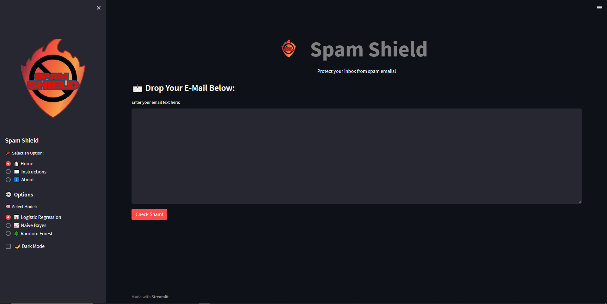
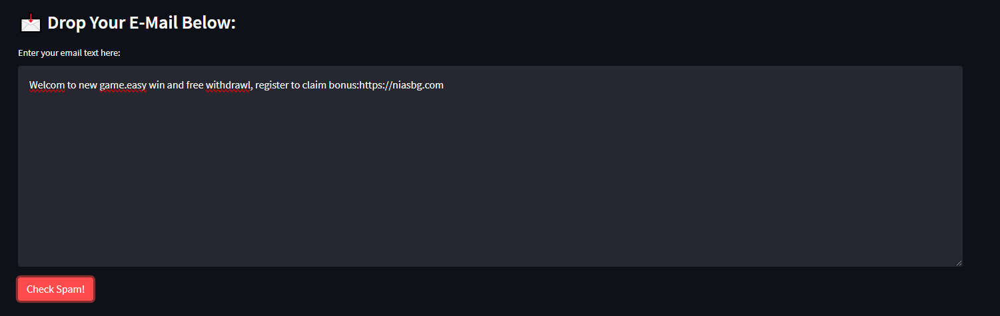
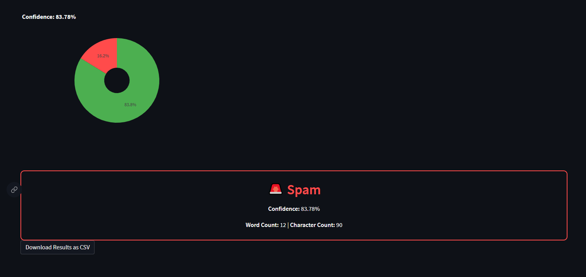
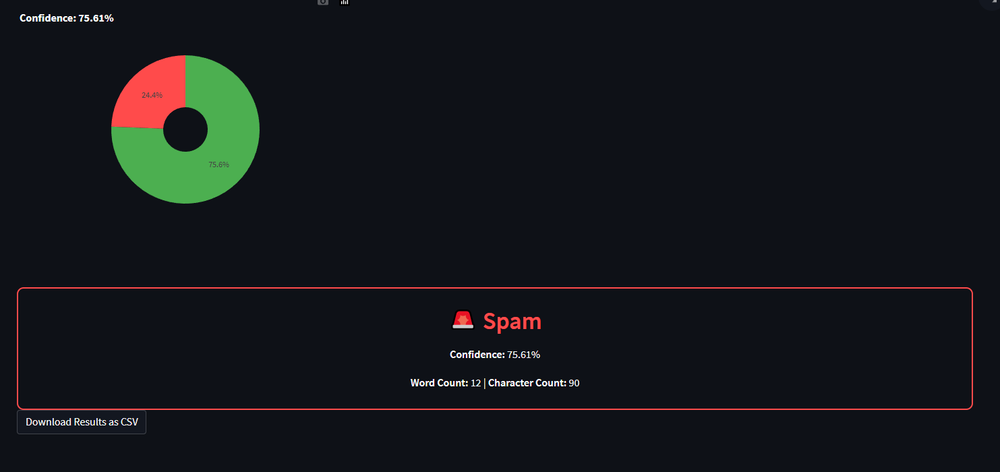
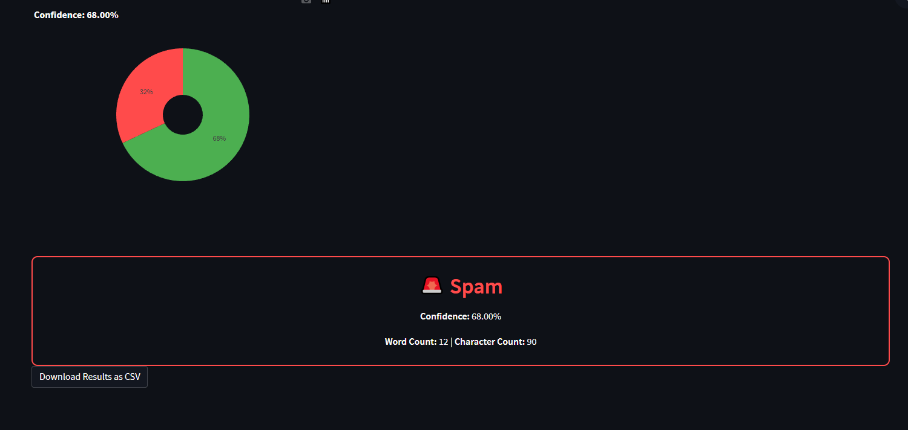

````markdown
# Spam Shield - Email Spam Classifier

Spam Shield is a machine learning-based web application that classifies emails as spam or ham (not spam). It uses three different machine learning models to ensure accurate classification and is built with Streamlit for an interactive web interface.

## Features
- **Machine Learning Models:** Logistic Regression, Naïve Bayes, and Random Forest.
- **Data Preprocessing:** Cleans and prepares email text using NLP techniques.
- **Feature Extraction:** Uses TF-IDF vectors to extract meaningful features.
- **Model Training & Visualization:** Models are trained, evaluated, and visualized for better understanding.
- **Model Deployment:** The best-performing model is saved using Joblib for real-time predictions.
- **Web Interface:** Built using Streamlit, allowing users to input emails and get instant classification results.

## Project Workflow
1. **Data Collection:** Load email dataset.
2. **Preprocessing:** Clean text and extract features using TF-IDF.
3. **Model Training:** Train and evaluate Logistic Regression, Naïve Bayes, and Random Forest models.
4. **Model Selection & Saving:** Choose the best model and save it using Joblib.
5. **Web Interface Deployment:** Build a Streamlit web app for real-time predictions.
6. **User Interaction:** Users input emails, and the model predicts spam or ham.

## Installation
### Prerequisites
Ensure you have Python 3.8 installed. Then, install the required dependencies:
```bash
pip install -r requirements.txt
````

### Running the Application

1. Clone the repository:

```bash
git clone https://github.com/yourusername/spam-shield.git
cd spam-shield
```

2. Run the Streamlit app:

```bash
streamlit run app.py
```

## Usage

- Open the Streamlit web app in your browser.
- Enter an email in the input field.
- Click the **Predict** button to see if the email is spam or ham.

## Technologies Used

- **Python**: Main programming language.
- **Jupyter Notebook**: Used for experimentation and model training.
- **Scikit-learn**: Machine learning models.
- **NLTK**: Natural language processing.
- **Pandas & NumPy**: Data handling and preprocessing.
- **Matplotlib**: Data visualization.
- **TF-IDF (Term Frequency-Inverse Document Frequency)**: Feature extraction technique.
- **Joblib**: Model serialization.
- **Streamlit**: Web interface.

## Screenshots & Videos

### Screenshots

#### Home Page


#### Email Input Section


#### Prediction Results

##### Logistic Regression


##### Naïve Bayes


##### Random Forest


### Demo Video


## Contributing

Feel free to fork the repository, make enhancements, and submit a pull request.

## License

This project is licensed under the MIT License.

## Contact

For any questions or suggestions, contact [Wasif Sohail](mailto\:wasifsohail66@gmail.com).

```
```
